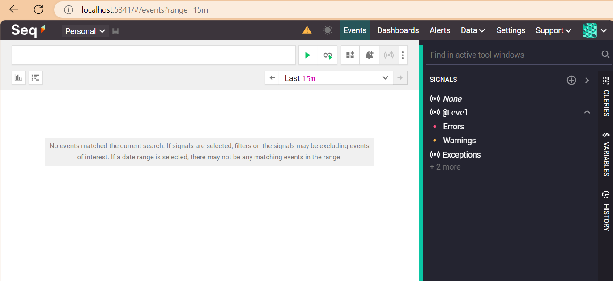
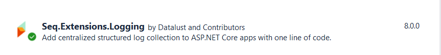
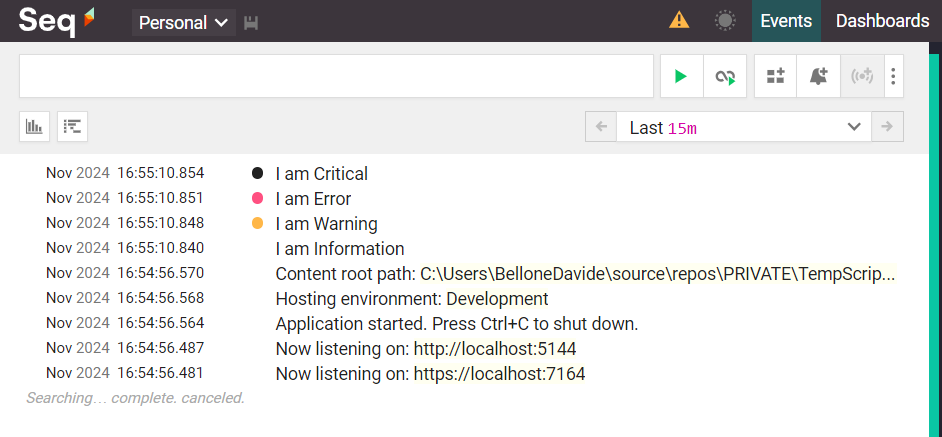
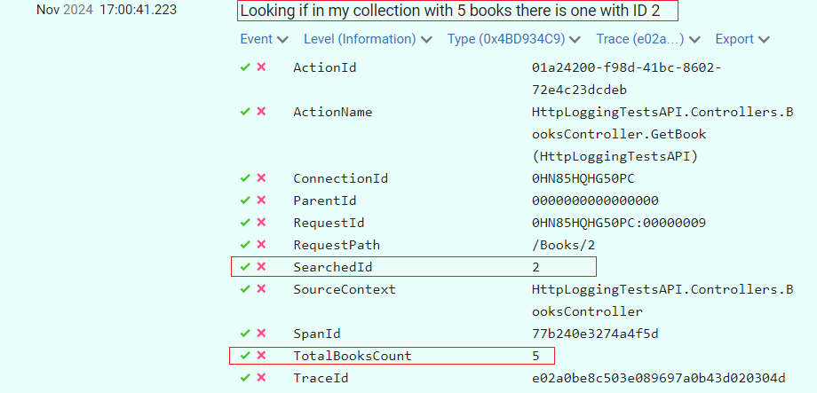

Logging is one of the most essential parts of any application.

Wouldn't it be great if we could scaffold and use a logging platform with just a few lines of code?

In this article, we are going to learn how to install and use Seq as a destination for our logs, and how to make an ASP.NET 8 API application send its logs to Seq by using the native logging implementation.

## Seq: a sink and dashboard to manage your logs

In the context of logging management, **a "sink" is a receiver of the logs generated by one or many applications**; it can be a cloud-based system, but it's not mandatory: even a file on your local file system can be considered a sink.

**[Seq](https://docs.datalust.co/v4/docs/getting-started) is a Sink, and works by exposing a server** that stores logs and events generated by an application. Clearly, other than just storing the logs, Seq allows you to view them, access their details, perform queries over the collection of logs, and much more.

It's free to use for individual usage, and comes with several pricing plans, depending on the usage and the size of the team.

Let's start small and install the free version.

We have two options:

1. Download it locally, using an installer ([here's the download page](https://datalust.co/Download));
2. Use Docker: pull the `datalust/seq` image locally and run the container on your Docker engine.

Both ways will give you the same result.

However, if you already have experience with Docker, I suggest you use the second approach.

Once you have Docker installed and running locally, open a terminal.

First, you have to **pull the Seq image locally** (I know, it's not mandatory, but I prefer doing it in a separate step):

```powershell
docker pull datalust/seq
```

Then, when you have it downloaded, you can start a new instance of Seq locally, exposing the UI on a specific port.

```powershell
docker run --name seq -d --restart unless-stopped -e ACCEPT_EULA=Y -p 5341:80 datalust/seq:latest
```

Let's break down the previous command:

- `docker run`: This command is used to create and start a new Docker container.
- `--name seq`: This option assigns the name _seq_ to the container. Naming containers can make them easier to manage.
- `-d`: This flag runs the container in _detached_ mode, meaning it runs in the background.
- `--restart unless-stopped`: This option ensures that the container will always restart unless it is explicitly stopped. This is useful for ensuring that the container remains running even after a reboot or if it crashes.
- `-e ACCEPT_EULA=Y`: This sets an _environment variable_ inside the container. In this case, it sets `ACCEPT_EULA` to `Y`, which likely indicates that you accept the End User License Agreement (EULA) for the software running in the container.
- `-p 5341:80`: This maps port 5341 on your host machine to port 80 in the container. This allows you to access the service running on port 80 inside the container via port 5341 on your host.
- `datalust/seq:latest`: This specifies the Docker image to use for the container. `datalust/seq` is the image name, and `latest` is the tag, indicating that you want to use the latest version of this image.

So, this command runs a container named `seq` in the background, ensures it restarts unless stopped, sets an environment variable to accept the EULA, maps a host port to a container port, and uses the latest version of the `datalust/seq` image.

It's important to pay attention to the used port: **by default, Seq uses port 5341 to interact with the UI and the API**. If you prefer to use another port, feel free to do that - just remember that you'll need some additional configuration.

Now that Seq is installed on your machine, you can access its UI. Guess what? It's on `localhost:5341`!



However, Seq is "just" a container for our logs - but we have to produce them.

## A sample ASP.NET API project

I've created a simple API project that exposes CRUD operations for a data model stored in memory (we don't really care about the details).

```cs
[ApiController]
[Route("[controller]")]
public class BooksController : ControllerBase
{
    public BooksController()
    {

    }

    [HttpGet("{id}")]
    public ActionResult<Book> GetBook([FromRoute] int id)
    {

        Book? book = booksCatalogue.SingleOrDefault(x => x.Id == id);
        return book switch
        {
            null => NotFound(),
            _ => Ok(book)
        };
    }
}
```

As you can see, the details here are not important.

Even the `Main` method is the default one:

```cs
var builder = WebApplication.CreateBuilder(args);

builder.Services.AddControllers();

builder.Services.AddEndpointsApiExplorer();
builder.Services.AddSwaggerGen();

var app = builder.Build();

if (app.Environment.IsDevelopment())
{
    app.UseSwagger();
    app.UseSwaggerUI();
}

app.UseHttpsRedirection();

app.MapControllers();

app.Run();
```

We have the Controllers, we have Swagger... well, nothing fancy.

Let's mix it all together.

## How to integrate Seq with an ASP.NET application

If you want to use Seq in an ASP.NET application (may it be an API application or whatever else), you have to add it to the startup pipeline.

First, you have to **install the proper NuGet package**: `Seq.Extensions.Logging`.



Then, you have to add it to your `Services`, calling the `AddSeq()` method:

```diff
var builder = WebApplication.CreateBuilder(args);

builder.Services.AddControllers();

builder.Services.AddEndpointsApiExplorer();
builder.Services.AddSwaggerGen();

+ builder.Services.AddLogging(lb => lb.AddSeq());

var app = builder.Build();
```

Now, Seq is ready to intercept whatever kind of log arrives at the specified port (remember, in our case, we are using the default one: 5341).

We can try it out by adding an `ILogger` to the `BooksController` constructor:

```cs
private readonly ILogger<BooksController> _logger;

public BooksController(ILogger<BooksController> logger)
{
    _logger = logger;
}
```

So that we can use the `_logger` instance to create logs as we want, using the necessary **Log Level**:

```cs
[HttpGet("{id}")]
public ActionResult<Book> GetBook([FromRoute] int id)
{
    _logger.LogInformation("I am Information");
    _logger.LogWarning("I am Warning");
    _logger.LogError("I am Error");
    _logger.LogCritical("I am Critical");

    Book? book = booksCatalogue.SingleOrDefault(x => x.Id == id);
    return book switch
    {
        null => NotFound(),
        _ => Ok(book)
    };
}
```



## Using Structured Logging with ILogger and Seq

One of the best things about Seq is that it automatically handles **Structured Logging**.

```cs
[HttpGet("{id}")]
public ActionResult<Book> GetBook([FromRoute] int id)
{
    _logger.LogInformation("Looking if in my collection with {TotalBooksCount} books there is one with ID {SearchedId}"
 , booksCatalogue.Count, id);

    Book? book = booksCatalogue.SingleOrDefault(x => x.Id == id);
    return book switch
    {
        null => NotFound(),
        _ => Ok(book)
    };
}
```

Have a look at this line:

```cs
_logger.LogInformation("Looking if in my collection with {TotalBooksCount} books there is one with ID {SearchedId}"
 , booksCatalogue.Count, id);
```

This line generates a string message, **replaces all the placeholders**, and, on top of that, creates two properties, `SearchedId` and `TotalBooksCount`; you can now define queries using these values.



## Further readings

I have to admit it: **logging management is one of my favourite topics**.

I've already written a sort of introduction to Seq in the past, but at that time, I did not use the native `ILogger`, but Serilog, a well-known logging library that added some more functionalities on top of the native logger.

🔗 [Logging with Serilog and Seq | Code4IT](https://www.code4it.dev/blog/logging-with-serilog-and-seq/)

_This article first appeared on [Code4IT 🐧](https://www.code4it.dev/)_

In particular, Serilog can be useful for propagating Correlation IDs across multiple services so that you can fetch all the logs generated by a specific operation, even though they belong to separate applications.

🔗 [How to log Correlation IDs in .NET APIs with Serilog](https://www.code4it.dev/blog/serilog-correlation-id/)

Feel free to search through my blog all the articles related to logging - I'm sure you will find interesting stuff!

## Wrapping up

**I think Seq is the best tool for local development**: it's easy to download and install, supports structured logging, and can be easily added to an ASP.NET application with just a line of code.

I usually add it to my private projects, especially when the operations I run are complex enough to require some well-structured log.

Given how it's easy to install, sometimes I use it for my work projects too: when I have to fix a bug, but I don't want to use the centralized logging platform (since it's quite complex to use), I add Seq as a destination sink, run the application, and analyze the logs in my local machine. Then, of course, I remove its reference, as I want it to be just a discardable piece of configuration.

I hope you enjoyed this article! Let's keep in touch on [LinkedIn](https://www.linkedin.com/in/BelloneDavide/), [Twitter](https://twitter.com/BelloneDavide) or [BlueSky](https://bsky.app/profile/bellonedavide.bsky.social)! 🤜🤛

Happy coding!

🐧
