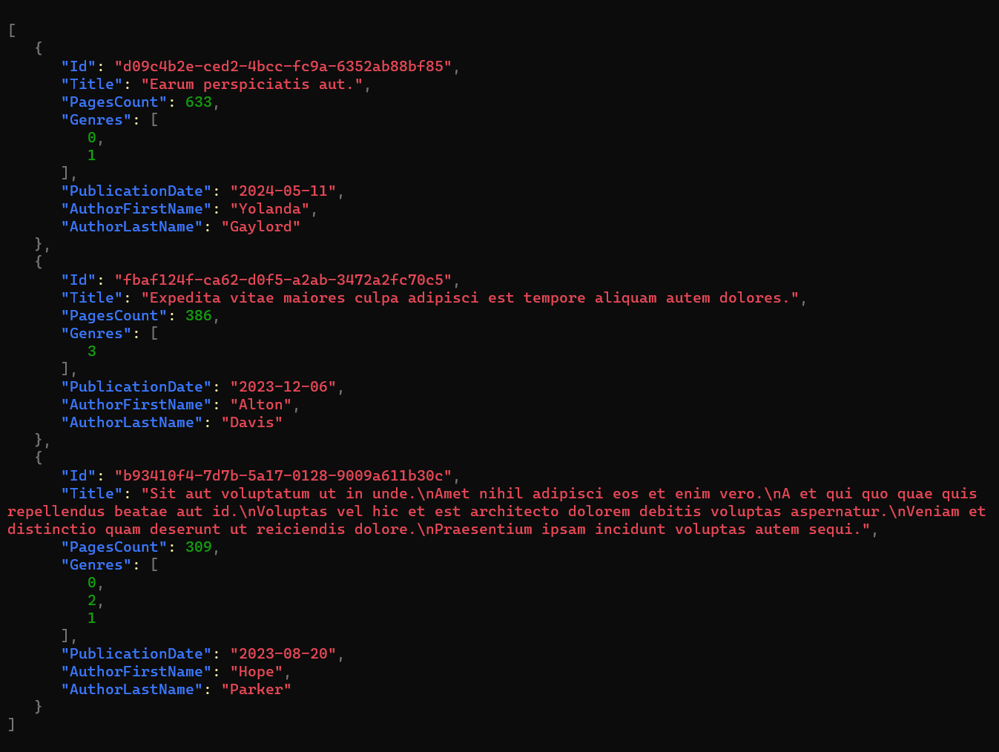

Sometimes you want to experiment with some features, or create a demo project, but you don't want to instantiate a real database instance. Also, you might want to use some realistic data - not just "test1", 123, and so on.

In this article, we're going to solve this problem by using Bogus and Entity Framework: you will learn how to generate realistic data and how to store them in an in-memory database.

## Bogus

[Bogus](https://github.com/bchavez/Bogus) is a popular library used to generate realistic data for your tests, allowing you to choose the category of dummy data that best fits your needs.

It all starts by installing Bogus via NuGet, by executing `Install-Package Bogus`.

From here, you can define so-called `Faker`s whose purpose is to generate dummy instances of your classes by autopopulating its fields.

Let's see a simple example. We have this POCO class named `Book`:

```cs
public class Book
{
    public Guid Id { get; set; }
    public string Title { get; set; }
    public int PagesCount { get; set; }
    public Genre[] Genres { get; set; }
    public DateOnly PublicationDate { get; set; }
    public string AuthorFirstName { get; set; }
    public string AuthorLastName { get; set; }
}

public enum Genre
{
    Thriller, Fantasy, Romance, Biography
}
```

*Note: for the sake of simplicity I used a dumb approach: author's first and last name are part of the Book info itself, and the Genres property is treated as an array of enums, and not as a [flagged enum](https://www.code4it.dev/blog/5-things-enums-csharp/#4-flagged-enums).*

From here, we can start creating our `Faker` by specifying the referenced type:

```cs
Faker<Book> bookFaker = new Faker<Book>();
```

From here we can add one or more `RuleFor` methods to create rules used to generate each property. 

The simplest approach is to use the overload where the first parameter is a Function pointing to the property to be populated, and the second is a Function that calls the methods provided by Bogus to create dummy data.

Think of it as this pseudocode:

```cs
faker.RuleFor(sm => sm.SomeProperty, f => f.SomeKindOfGenerator.DoSomething());
```

Another approach is to pass as first argument the name of the property, like this:

```cs
faker.RuleFor("myName", f=> f.SomeKindOfGenerator.DoSomething())
```

A third approach is to define a generator for a specific type, saying "every time you're trying to map a property with this type, use this generator".

```cs
bookFaker.RuleForType(typeof(DateOnly), f => f.Date.PastDateOnly());
```

### Generate random GUIDs with Bogus

We can generate random GUIDs like this:

```cs
bookFaker.RuleFor(b => b.Id, f => f.Random.Guid());
```

In a similar way, you can generate *Uuid* by calling `f.Random.Uuid()`.

### Generate random text with Bogus

We can generate random text, following the Lorem Ipsum structure, to pick a single word or a longer text:

Using `Text` you generate random text:

```cs
bookFaker.RuleFor(b => b.Title, f => f.Lorem.Text());
```

However, you can use several other methods to generate text with different lenght, such as `Letter`, `Word`, `Paragraphs`, `Sentences`, and more.

### Working with Enums with Bogus

If you have an enum, you can rely again on the `Random` property of the Faker and get a random subset of the enums like this:

```cs
bookFaker.RuleFor(b => b.Genres, f => f.Random.EnumValues<Genre>(2));
```

As you can see, I specified the number of random items to use (in this case, 2). If you don't set it, it will take a random number of items.

However, the previous method returns an array of elements. If you want to get a single enum, you should use `f.Rando.Enum<Genre>()`.

### Person-related dummy values with Bogus

One of the most interesting features of Bogus is the ability to generate realistic data for common entities, such as a person.

In particular, you can use the `Person` property to generate data related to the first name, last name, Gender, UserName, Phone, Website, and much more.

You can use it this way:

```cs
bookFaker.RuleFor(b => b.AuthorFirstName, f => f.Person.FirstName);
bookFaker.RuleFor(b => b.AuthorLastName, f => f.Person.LastName);
```


### Generate items with Bogus

Now that we've defined our rules, we can generate the actual items.

You just need to call the `Generate` method. You can also specify the number of items to generate by passing a number as a first parameter:

```cs
List<Book> books = bookFaker.Generate(2);
```

If you want to generate a random quantity of items, you can use the `GenerateBetween` method, specifying the top and bottom limit:

```cs
List<Book> books = bookFaker.GenerateBetween(2, 5);
```

### Wrapping up the Faker example

Now that we've learned how to generate a Faker, we can refactor the code to make it easier to read:


```cs
private List<Book> GenerateBooks(int count)
{
    Faker<Book> bookFaker = new Faker<Book>()
        .RuleFor(b => b.Id, f => f.Random.Guid())
        .RuleFor(b => b.Title, f => f.Lorem.Text())
        .RuleFor(b => b.Genres, f => f.Random.EnumValues<Genre>())
        .RuleFor(b => b.AuthorFirstName, f => f.Person.FirstName)
        .RuleFor(b => b.AuthorLastName, f => f.Person.LastName)
        .RuleFor(nameof(Book.PagesCount), f => f.Random.Number(100, 800))
        .RuleForType(typeof(DateOnly), f => f.Date.PastDateOnly());

    return bookFaker.Generate(count);
}
```

If we run it, we can see it generates the following items:



## In-memory database

## Wrapping up

## Further readings

_This article first appeared on [Code4IT 🐧](https://www.code4it.dev/)_


## Wrapping up


I hope you enjoyed this article! Let's keep in touch on [Twitter](https://twitter.com/BelloneDavide) or [LinkedIn](https://www.linkedin.com/in/BelloneDavide/)! 🤜🤛

Happy coding!

🐧


- [ ] Grammatica
- [ ] Titoli
- [ ] Frontmatter
- [ ] Immagine di copertina
- [ ] Fai resize della immagine di copertina
- [ ] Metti la giusta OgTitle
- [ ] Bold/Italics
- [ ] Nome cartella e slug devono combaciare
- [ ] Rinomina immagini
- [ ] Alt Text per immagini
- [ ] Trim corretto per bordi delle immagini
- [ ] Rimuovi secrets dalle immagini
- [ ] Controlla se ASP.NET Core oppure .NET
- [ ] Pulizia formattazione
- [ ] Add wt.mc_id=DT-MVP-5005077 to links


https://github.com/bchavez/Bogus/blob/master/Examples/EFCoreSeedDb/Program.cs