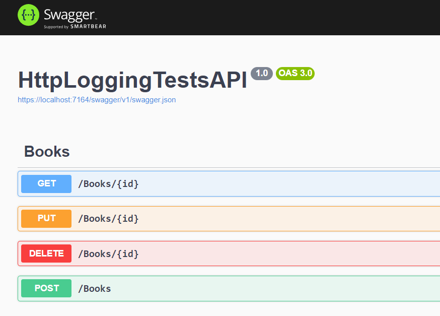
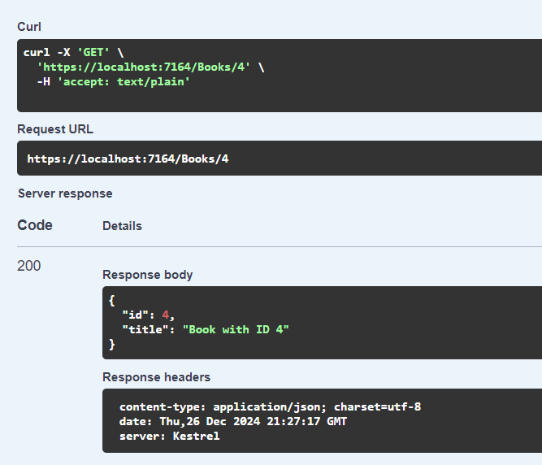
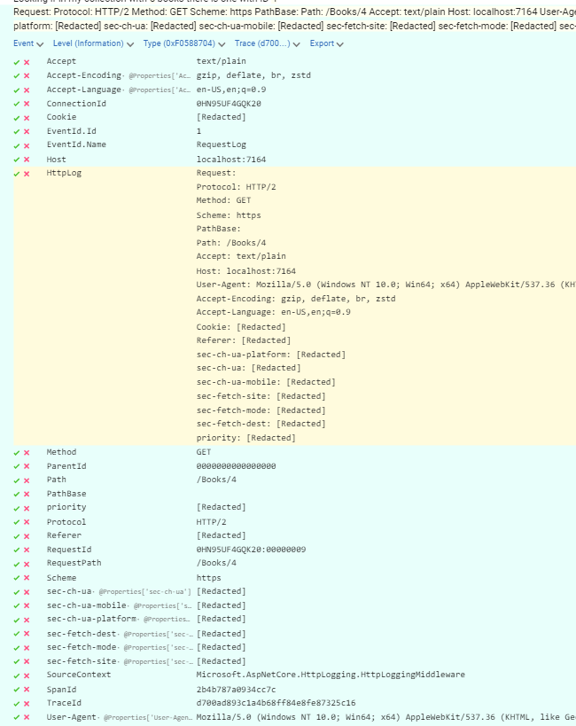
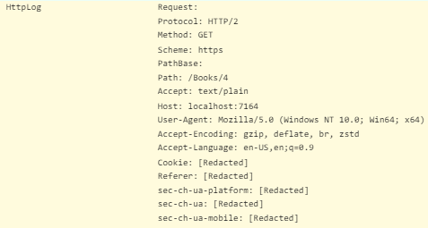
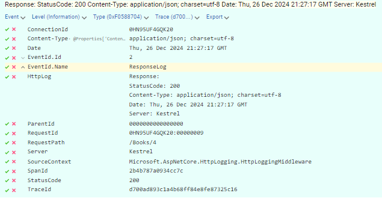
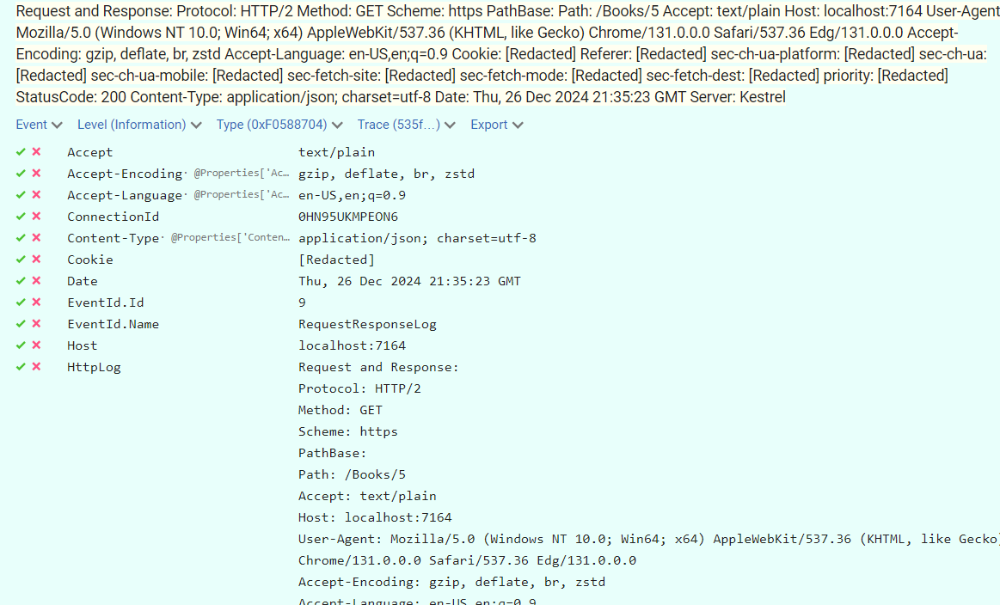

 
Whenever we publish a service, it is important to add proper logging to the application. **Logging helps us understand how the system works and behaves**, and it's a fundamental component that allows us to troubleshoot problems that occur during the actual usage of the application.

In this blog, we have talked several times about logging. However, we mostly focused on the logs that were written manually.

In this article, we will learn how to log incoming HTTP requests to help us understand how our APIs are being used from the outside.

## Scaffolding the empty project

To showcase this type of logging, I created an ASP.NET API. It's a very simple application with CRUD operations on an in-memory collection. 

```cs
[ApiController]
[Route("[controller]")]
public class BooksController : ControllerBase
{
    private readonly List<Book> booksCatalogue = Enumerable.Range(1, 5).Select(index => new Book
    {
        Id = index,
        Title = $"Book with ID {index}"
    }).ToList();

    private readonly ILogger<BooksController> _logger;

    public BooksController(ILogger<BooksController> logger)
    {
        _logger = logger;
    }
}
```

These CRUD operations are exposed via HTTP APIs, following the usual verb-based convention. 

For example:

```cs
[HttpGet("{id}")]
public ActionResult<Book> GetBook([FromRoute] int id)
{
    _logger.LogInformation("Looking if in my collection with {TotalBooksCount} books there is one with ID {SearchedId}"
            , booksCatalogue.Count, id);

    Book? book = booksCatalogue.SingleOrDefault(x => x.Id == id);

    return book switch
    {
        null => NotFound(),
        _ => Ok(book)
    };
}
```

As you can see, I have added some custom logs: before searching for the element with the specified ID, I also wrote a log message such as "Looking if in my collection with 5 books there is one with ID 2". 

Where can I find the message? For the sake of this article, I decided to use Seq!

**Seq is a popular log sink** (well, as you may know, my favourite one!), that is easy to install and to integrate with .NET. I've thoroughly explained how to use Seq in conjunction with ASP.NET in [this article](https://www.code4it.dev/blog/logging-with-ilogger-and-seq/) and in other ones.

In short, the most important change in your application is to add Seq as the log sink, like this:

```cs
builder.Services.AddLogging(lb => {
    lb.AddSeq();
});
```

Now, whenever I call the GET endpoint, I can see the related log messages appear in Seq:


But sometimes it's not enough. I want to see more details, and I want them to be applied everywhere!

## How to add HTTP Logging to an ASP.NET application

HTTP Logging is a way of logging most of the details of the incoming HTTP operations, **tracking both the requests and the responses**.

With HTTP Logging, you don't need to manually write custom logs to access the details of incoming requests: you just need to add its related middleware, configure it as you want, and have all the required logs available for all your endpoints.

Adding it is pretty straightforward: you first need to add the `HttpLogging` middleware to the list of services:

```cs
builder.Services.AddHttpLogging(lb => { });
```

so that you can use it once the `WebApplication` instance is built:

```cs
app.UseHttpLogging();
```

There's still a problem, though: **all the logs generated via HttpLogging are, by default, ignored**, as logs coming from their namespace (named `Microsoft.AspNetCore.HttpLogging.HttpLoggingMiddleware`) are at *Information* log level, thus ignored because of the default configurations. 

You either have to update the `appsetting.json` file to **tell the logging system to process logs from that namespace**:

```json
{
    "Logging": {
        "LogLevel": {
            "Default": "Information",
            "Microsoft.AspNetCore": "Warning",
            "Microsoft.AspNetCore.HttpLogging.HttpLoggingMiddleware": "Information"
        }
    }
}
```

or, alternatively, you need to do the same when setting up the logging system in the Program class:

```diff
builder.Services.AddLogging(lb => {
  lb.AddSeq();
+ lb.AddFilter("Microsoft.AspNetCore.HttpLogging.HttpLoggingMiddleware", LogLevel.Information);
});
```

We then have all our pieces in place: let's execute the application!

First, you can spin up the API; you should be able to see the Swagger page:




From here, you can call the GET endpoint:  



You should now able to see all the logs in Seq:


As you can see from the screenshot above, I have a log entry for the request and one for the response. Also, of course, I have the custom message I added manually in the C# method.

### Understanding HTTP Request logs

Let's focus on the data logged for the HTTP request.

If we open the log related to the HTTP request, we can see all these values:



Among these details, we can see properties such as:

- the host name (*localhost:7164*)
- the method (*GET*)
- the path (*/books/4*)

and much more. 

You can see all the properties as standalone items, but you can also have a grouped view of all the properties by accessing the `HttpLog` element:



Notice that for some elements we do not have access to the actual value, as **the value is set to `[Redacted]`**. This is a default configuration that prevents logging too many things (and undisclosing some values) as well as writing too much content on the log sink (the more you write, the less performant the queries become - and you also pay more!).

Among other redacted values, you can see that even the Cookie value is not directly available - for the same reasons explained before.

### Understanding HTTP Response logs

Of course, we can see some interesting data in the Response log:



Here, among some other properties such as the *Host Name*, we can see the *Status Code* and the *Trace Id* (which, as you may notice, is the same as the one in te Request).

As you can see, the log item does not contain the body of the response. 

Also, just as it happens with the Request, we do not have access to the list of HTTP Headers.

## How to save space, storage, and money by combining log entries

For every HTTP operation, we end up with 2 log entries: one for the Request and one for the Response.

However, it would be more practical to **have both request and response info stored in the same log item** so we can understand more easily what is happening.

Lucky for us, this functionality is already in place. We just need to set the `CombineLogs` property to `true` when we add the HttpLogging functionality:

```diff
builder.Services.AddHttpLogging(lb =>
{
+  lb.CombineLogs = true;
}
);
```

Then, we are able to see the data for both the request and the related response in the same log element.



## The downsides of using HTTP Logging

Even though everything looks nice and pretty, adding HTTP Logging has some serious consequences.

First of all, remember that you are doing some more operations for every incoming HTTP request. Just processing and storing the log messages can bring to an **application performance downgrade** - you are using parts of the processing resources to interpret the HTTP context, create the correct log entry, and store it.

Depending on how your APIs are structured, you may need to **strip out sensitive data**: HTTP Logs, by default, log almost everything (except for the parts stored as Redacted). Since you don't want to store as plain text the content of the requests, you may need to create custom logic to redact parts of the request and response you want to hide: you may need to implement a [custom IHttpLoggingInterceptor](https://learn.microsoft.com/en-us/aspnet/core/fundamentals/http-logging/?view=aspnetcore-9.0&wt.mc_id=DT-MVP-5005077#ihttplogginginterceptor).

Finally, consider that logging occupies storage, and storage has a cost. **The more you log, the higher the cost**. You should define proper strategies to avoid excessive storage costs while keeping valuable logs.

## Further readings

There is a lot more, as always. In this article, I focused on the most essential parts, but the road to having proper HTTP Logs is still long.

You may want to start from the official documentation, of course!

🔗 [HTTP logging in ASP.NET Core | Microsoft Docs](https://learn.microsoft.com/en-us/aspnet/core/fundamentals/http-logging/?view=aspnetcore-9.0&wt.mc_id=DT-MVP-5005077)

_This article first appeared on [Code4IT 🐧](https://www.code4it.dev/)_

All the logs produced for this article were stored on Seq. You can find more info about installing and integrating Seq in ASP.NET Core in this article:

🔗 [Easy logging management with Seq and ILogger in ASP.NET | Code4IT](https://www.code4it.dev/blog/logging-with-ilogger-and-seq/)

## Wrapping up

HTTP Logging can be a good tool for understanding the application behaviour and detecting anomalies. However, as you can see, there are some important downsides that need to be considered.

I hope you enjoyed this article! Let's keep in touch on [LinkedIn](https://www.linkedin.com/in/BelloneDavide/) or [Twitter](https://twitter.com/BelloneDavide)! 🤜🤛

Happy coding!

🐧
