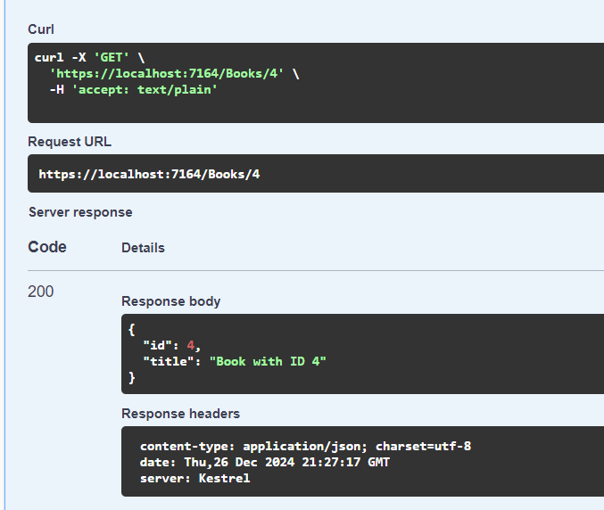
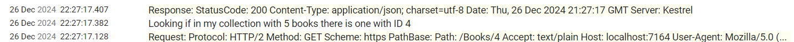
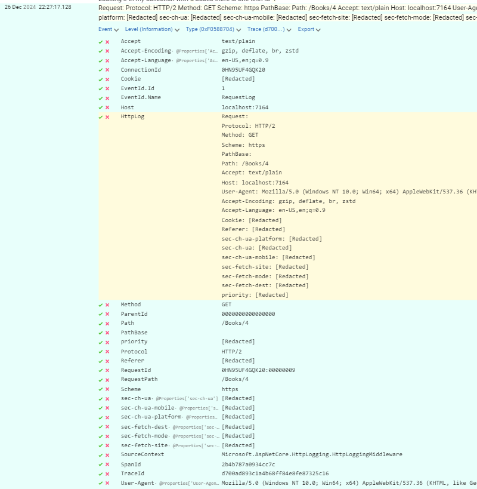
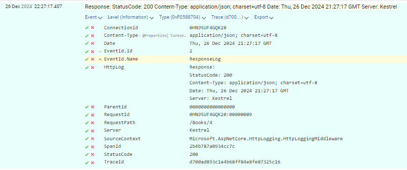

 
Whenever we publish a service, it is important to add proper logging to the application. Logging helps us understand how the system works and behaves, and it's a fundamental component that helps us troubleshoot problems that occur during the actual usage of the application.

We have talked several times about logging. But we mostly focused on the logs written manually.

In this article, we are going to learn how to log incoming HTTP requests to help us understand how our ASP.NET APIs are being used from the outside.

## Descrizione progetto, SEQ, Postman, demo vuota

To showcase this type of logging, I created an ASP.NET 8 API. It's a very simple application, with CRUD operations on an in-memory collection. 


```cs
[ApiController]
[Route("[controller]")]
public class BooksController : ControllerBase
{
    private readonly List<Book> booksCatalogue = Enumerable.Range(1, 5).Select(index => new Book
    {
        Id = index,
        Title = $"Book with ID {index}"
    }).ToList();

    private readonly ILogger<BooksController> _logger;

    public BooksController(ILogger<BooksController> logger)
    {
        _logger = logger;
    }
}
```

These CRUD operations are exposed via HTTP APIs, following the usual verb-based convention, for example:

```cs
[HttpGet("{id}")]
public ActionResult<Book> GetBook([FromRoute] int id)
{

    _logger.LogInformation("Looking if in my collection with {TotalBooksCount} books there is one with ID {SearchedId}"
        , booksCatalogue.Count, id);

    Book? book = booksCatalogue.SingleOrDefault(x => x.Id == id);
    return book switch
    {
        null => NotFound(),
        _ => Ok(book)
    };
}
```

As you can see, I have added some custom logs: in the previous method, before searching for the element with the specified ID, I also write a log message such as "Looking if in my collection with 5 books there is one with ID 2". 

Where can I find the message? Well, on Seq!

Seq is a popular log sink (well, honestly, my favourite one!), that is easy to install and to integrate with .NET. I've thoroughly explained how to use Seq in conjunction with .NET in [this article](https://www.code4it.dev/blog/logging-with-ilogger-and-seq/).

In short the only change in your code is to add Seq as the log sink, like this:

```cs
builder.Services.AddLogging(lb => {
    lb.AddSeq();
});
```

Having Seq ready to use in my .NET application, I can see the log messages appear in the log list:


But sometimes it's not enough. I want more, and I want it automatic!

## Descrizione HTTP logging

HTTP Logging is a way of logging most of the details of the incoming HTTP operations, tracking both the requests and the resposes.

With HTTP logging you don't need to write custom logs to access the details of incoming requests: you just need to add a middleware, configure it as you want, and have all the required logs available in all your endpoints.

Adding it is pretty straightforward: you first need to add the `HttpLogging` middleware to the list of services:

```cs
builder.Services.AddHttpLogging(_ => { });
```

so that you can use it once the WebApplication instance is built:

```cs
app.UseHttpLogging();
```

There's still a problem, though: all the logs generated via HttpLogging are ignored, as logs coming from their namespace (named `Microsoft.AspNetCore.HttpLogging.HttpLoggingMiddleware`) are at *Information* log level, thus ignored by default. 

You either have to update the `appsetting.json` file to tell the logging system to preocess such logs:

```json
"Logging": {
  "LogLevel": {
    "Default": "Information",
    "Microsoft.AspNetCore": "Warning",
    "Microsoft.AspNetCore.HttpLogging.HttpLoggingMiddleware": "Information"
  }
}
```

or, alternatively, you need to do the same when setting up the logging system in the Program class:

```diff
builder.Services.AddLogging(lb => {
    lb.AddSeq();
+   lb.AddFilter("Microsoft.AspNetCore.HttpLogging.HttpLoggingMiddleware", LogLevel.Information);
});
```

We then have all our pieces into place: let's execute the application!

First, you can spin up the API, and see the Swagger page:


Now I can call the GET endpoint  



and see all the logs in Seq:



As you can see, I have a log entry for the request, and one for the response.

If we open the log related to the HTTP request, we can see all these values:


And, of course, we can see some interesting data in the Response log:



### Analizza Request

-redacted
lista header
- no cookie
### Analizza Response

-no body
-lista header

## Unifica log con 

```
  logging.CombineLogs = true;
```


https://learn.microsoft.com/en-us/aspnet/core/fundamentals/http-logging/?view=aspnetcore-9.0&wt.mc_id=DT-MVP-5005077

- prova diversi verbi http
- prova diversi content type
- prova header
- prova con body testuale
- prova con body come file
- prova con minimal api


## Warning

- peggioramento performance apps
- logga dati sensibili
- maggiori costi su storage di log
- 


## Further readings

_This article first appeared on [Code4IT 🐧](https://www.code4it.dev/)_

🔗 [Easy logging management with Seq and ILogger in ASP.NET | Code4IT](https://www.code4it.dev/blog/logging-with-ilogger-and-seq/)

## Wrapping up


I hope you enjoyed this article! Let's keep in touch on [LinkedIn](https://www.linkedin.com/in/BelloneDavide/) or [Twitter](https://twitter.com/BelloneDavide)! 🤜🤛

Happy coding!

🐧


- [ ] Grammatica
- [ ] Titoli
- [ ] Frontmatter
- [ ] Immagine di copertina
- [ ] Fai resize della immagine di copertina
- [ ] Metti la giusta OgTitle
- [ ] Bold/Italics
- [ ] Nome cartella e slug devono combaciare
- [ ] Rinomina immagini
- [ ] Alt Text per immagini
- [ ] Trim corretto per bordi delle immagini
- [ ] Rimuovi secrets dalle immagini
- [ ] Controlla se ASP.NET Core oppure .NET
- [ ] Pulizia formattazione
- [ ] Add wt.mc_id=DT-MVP-5005077 to links
- 