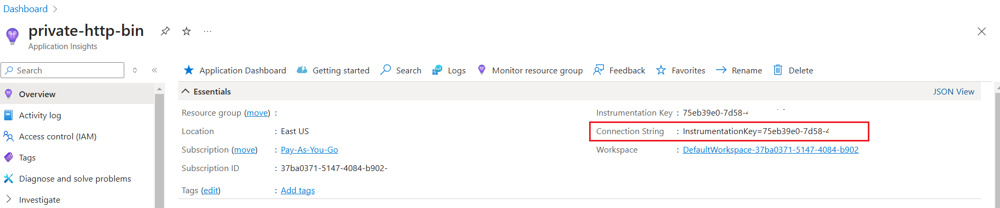

Logging is crucial for any application. However, generating logs is not enough: you also have to store them somewhere in order to access them.

Application Insights is one of the tools that allow you to store your logs in a cloud enviroment, prividing you with a UI and a query editor that gives you the possibility to drill down into the details of your logs.

In this article, we are going to learn how to integrate Azure Application Insights with an ASP.NET Core application. We will also focus on how Application Insights treats log properties such as Log Levels and Structured Logging.

For the sake of this article, I'm working on an API project with HTTP Controllers with only one endpoint. The same approach can be used for other types of applications.

## How to retrieve the Azure Application Insights connection string

Azure Application Insights can be accessed via browser by using the Azure Portal.

Once you have an instance ready, all you need to do is to get the value of the connection string to that resource.

You can retrieve it in two ways: by looking at the Connection String property in the resource overview panel:



Or, alternatively, by navigating to the Configure > Properties page, and locating the Connection String field.


Either ways are fine.

## How to add Azure Application Insights to an ASP.NET Core application

Now that you have the connection string, you can place it in the configuration file - or, however, in a place that can be accessible from you application.

To configure ASP.NET Core to use Application Insights, you first have to install the `Microsoft.Extensions.Logging.ApplicationInsights` NuGet package.

Now you can add a new configuration to the Program class (or wherever you configure your services and the ASP.NET core pipeline):

```cs
builder.Logging.AddApplicationInsights(
configureTelemetryConfiguration: (config) =>
    config.ConnectionString = "InstrumentationKey=your-connection-string",
    configureApplicationInsightsLoggerOptions: (options) => { }
);
```

The `configureApplicationInsightsLoggerOptions` allows you to configure some additional properties: `TrackExceptionsAsExceptionTelemetry`, `IncludeScopes` and `FlushOnDispose`. These properties are by default set to `true`, so most probably you don't want to change the default behavior (except one, that we'll modify later on).

And that's it! You have Application Insights ready to be used.

## How log levels are tracked on Application Insights

I have this API endpoint that does nothing fancy: it just returns a random number.

```cs
[Route("api/[controller]")]
[ApiController]
public class MyDummyController(ILogger<DummyController> logger) : ControllerBase
{
    private readonly ILogger<DummyController> _logger = logger;

    [HttpGet]
    public async Task<IActionResult> Get()
    {
        int number = Random.Shared.Next();
        return Ok(number);
    }
}
```

We can use it to run experiments on how logs are treated using Application Insights.

First, let's add some simple log messages in the `Get` endpoint:

```cs
[HttpGet]
public async Task<IActionResult> Get()
{
    int number = Random.Shared.Next();

    _logger.LogDebug("A debug log");
    _logger.LogTrace("A trace log");
    _logger.LogInformation("An information log");
    _logger.LogWarning("A warning log");
    _logger.LogError("An error log");
    _logger.LogCritical("A critical log");

    return Ok(number);
}
```

These are just plain messages. Let's search for them in Application Insights!

You first have to run the application - duh! - and what for a 2 or 3 minutes to have the logs ready on Azure.

Then, you can access the logs panel and run access the logs stored in the `traces` table.


As you can see, the messages appear in the query result.

There are two important things to notice:

- the log levels before Information are ignored by defaul (in fact, you cannot see them in the query result)
- the Log Levels are exposed as numbers in the severityLevel column: the higher the value, the higher the level of the log.

## Structured Logging

```cs
[HttpGet]
public async Task<IActionResult> Get()
{

    int number = Random.Shared.Next();
    string user = "john.doe";
    _logger.LogInformation("The number is {RandomNumber}, picked by user {Username}", number, user);

}
```

## Further readings

_This article first appeared on [Code4IT 🐧](https://www.code4it.dev/)_

## Wrapping up

I hope you enjoyed this article! Let's keep in touch on [LinkedIn](https://www.linkedin.com/in/BelloneDavide/), [Twitter](https://twitter.com/BelloneDavide) or [BlueSky](https://bsky.app/profile/bellonedavide.bsky.social)! 🤜🤛

Happy coding!

🐧

- [ ] Grammatica
- [ ] Titoli
- [ ] Frontmatter
- [ ] Immagine di copertina
- [ ] Fai resize della immagine di copertina
- [ ] Metti la giusta OgTitle
- [ ] Bold/Italics
- [ ] Nome cartella e slug devono combaciare
- [ ] Rinomina immagini
- [ ] Alt Text per immagini
- [ ] Trim corretto per bordi delle immagini
- [ ] Rimuovi secrets dalle immagini
- [ ] Controlla se ASP.NET Core oppure .NET
- [ ] Pulizia formattazione
- [ ] Add wt.mc_id=DT-MVP-5005077 to links

## Appunti vari

https://learn.microsoft.com/en-us/azure/azure-monitor/app/ilogger#aspnet-core-applications

### Installazione

connection strring application insights
add Microsoft.Extensions.Logging.ApplicationInsights

```cs

builder.Logging.AddApplicationInsights(
configureTelemetryConfiguration: (config) =>
    config.ConnectionString = "",
    configureApplicationInsightsLoggerOptions: (options) => { }
);

```

### log normali

```cs
[HttpGet]
public async Task<IActionResult> Get()
{
    _logger.LogInformation("An information log");
    _logger.LogWarning("A warning log");
    _logger.LogError("An error log");

    int number = Random.Shared.Next();

    return Ok(number);
}
```

Metti screenshot
Spiega che i log si vedono su AppInsight dopo circa 2 minuti da quando sono stati generati

### Log con structured log

```cs
[HttpGet]
public async Task<IActionResult> Get()
{
    _logger.LogInformation("An information log");
    _logger.LogWarning("A warning log");
    _logger.LogError("An error log");


    int number = Random.Shared.Next();
    string user = "john.doe";
    _logger.LogInformation("The picked number is {RandomNumber}, picked by user {Username}", number, user);

    return Ok(number);
}
```

structured log, con screenshot dei log

I valori si trovano in `customDimensions`

### Eccezioni

```cs
private async Task SomethingWithException(int number)
{
    try
    {
        throw new AbandonedMutexException("An exception message");
    }
    catch (Exception ex)
    {
        _logger.LogError(ex, "Unable to complete the operation for number {ThisNumber}", number);
    }
}
```

Solo cosí il log dell'eccezione non compare!
https://github.com/Azure/Azure-Functions/issues/1762

### Scopes

scopes, con dizionario e screenshot

```cs
  [HttpGet]
  public async Task<IActionResult> Get()
  {
      _logger.LogInformation("An information log");
      _logger.LogWarning("A warning log");
      _logger.LogError("An error log");


      int number = Random.Shared.Next();
      string user = "john.doe";
      _logger.LogInformation("The picked number is {RandomNumber}, picked by user {Username}", number, user);

      await InternalMethod1(number);

      return Ok(number);
  }

  private async Task InternalMethod1(int inputNumber)
  {
      using (_logger.BeginScope("Internal Method 1 {Number}", inputNumber))
      {
          using (_logger.BeginScope(new Dictionary<string, object>()
          {
              ["DoubledNumber"] = inputNumber*2
          }))
          {
              await Task.Delay(1000);
              _logger.LogInformation("I have waited for a bit");
              await InternalMethod2(inputNumber % Random.Shared.Next());
          }
      }
  }

  private async Task InternalMethod2(int theValue)
  {

      using (_logger.BeginScope("Internal Method 2 {Number2}", theValue))
      {
          using (_logger.BeginScope(new Dictionary<string, object>()
          {
              ["TheSolution"] = theValue
          }))
          {
              await Task.Delay(theValue % 1000);
              _logger.LogInformation("Bottom level info!");
          }
      }
  }
```

Si vedono i valori del dizionario?
Si vede il messaggio del Begin Scope? Sí, nel campo OriginalFormat
Internal Method 2 {Number2}, ma non fa replace del valore né tiene conto dei livelli superiori.
