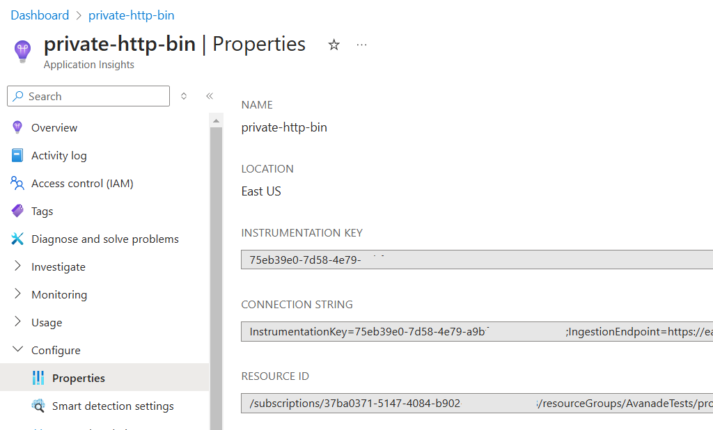
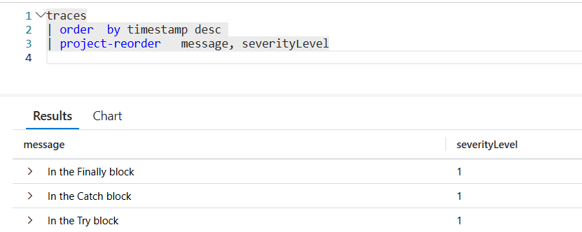

Logging is crucial for any application. However, generating logs is not enough: you must store them somewhere to access them.

Application Insights is one of the tools that allows you to store your logs in a cloud environment. It provides a UI and a query editor that allows you to drill down into the details of your logs.

In this article, we will learn how to integrate Azure Application Insights with an ASP.NET Core application and how Application Insights treats log properties such as Log Levels and exceptions.

For the sake of this article, I'm working on an API project with HTTP Controllers with only one endpoint. The same approach can be used for other types of applications.

## How to retrieve the Azure Application Insights connection string

Azure Application Insights can be accessed via any browser by using the Azure Portal.

Once you have an instance ready, you can simply get the value of the connection string for that resource.

You can retrieve it in two ways.

You can get the connection string by looking at the Connection String property in the *resource overview panel*:


The alternative is to navigate to the *Configure > Properties* page and locate the Connection String field.



## How to add Azure Application Insights to an ASP.NET Core application

Now that you have the connection string, you can place it in the configuration file or, in general, store it in a place that is accessible from your application.

To configure ASP.NET Core to use Application Insights, you must first install the `Microsoft.Extensions.Logging.ApplicationInsights` NuGet package.

Now you can add a new configuration to the Program class (or wherever you configure your services and the ASP.NET core pipeline):

```cs
builder.Logging.AddApplicationInsights(
configureTelemetryConfiguration: (config) =>
 config.ConnectionString = "InstrumentationKey=your-connection-string",
 configureApplicationInsightsLoggerOptions: (options) => { }
);
```

The `configureApplicationInsightsLoggerOptions` allows you to configure some additional properties: `TrackExceptionsAsExceptionTelemetry`, `IncludeScopes`, and `FlushOnDispose`. These properties are by default set to `true`, so you probably don't want to change the default behaviour (except one, which we'll modify later).

And that's it! You have Application Insights ready to be used.

## How log levels are stored and visualized on Application Insights

I have this API endpoint that does nothing fancy: it just returns a random number.

```cs
[Route("api/[controller]")]
[ApiController]
public class MyDummyController(ILogger<DummyController> logger) : ControllerBase
{
 private readonly ILogger<DummyController> _logger = logger;

    [HttpGet]
    public async Task<IActionResult> Get()
    {
        int number = Random.Shared.Next();
        return Ok(number);
    }
}
```

We can use it to run experiments on how logs are treated using Application Insights.

First, let's add some simple log messages in the `Get` endpoint:

```cs
[HttpGet]
public async Task<IActionResult> Get()
{
    int number = Random.Shared.Next();

    _logger.LogDebug("A debug log");
    _logger.LogTrace("A trace log");
    _logger.LogInformation("An information log");
    _logger.LogWarning("A warning log");
    _logger.LogError("An error log");
    _logger.LogCritical("A critical log");

    return Ok(number);
}
```

These are just plain messages. Let's search for them in Application Insights!

You first have to run the application - duh! - and **wait for a couple of minutes for the logs to be ready on Azure**. So, remember not to close the application immediately: you have to give it a few seconds to send the log messages to Application Insights.

Then, you can open the logs panel and access the logs stored in the `traces` table.


As you can see, the messages appear in the query result.

There are three important things to notice:

- in .NET, the log level is called "Log Level", while on Application Insights it's called "severity level";
- **the log levels lower than Information are ignored by default** (in fact, you cannot see them in the query result);
- the Log Levels are exposed as numbers in the severityLevel column: the higher the value, the higher the log level.

So, if you want to update the query to show only the log messages that are at least Warnings, you can do something like this:

```kql
traces
| where severityLevel >= 2
| order  by timestamp desc
| project timestamp, message, severityLevel
```

## How to log exceptions on Application Insights

In the previous example, we logged errors like this:

```cs
_logger.LogError("An error log");
```

Fortunately, **`ILogger` exposes an overload that accepts an exception in input** and logs all the details.

Let's try it by throwing an exception (I chose `AbandonedMutexException` because it's totally nonsense in this simple context, so it's easy to spot).

```cs
private void SomethingWithException(int number)
{
    try
    {
        _logger.LogInformation("In the Try block");

        throw new AbandonedMutexException("An exception message");
    }
    catch (Exception ex)
    {
        _logger.LogInformation("In the Catch block");
        _logger.LogError(ex, "Unable to complete the operation");
    }
    finally
    {
        _logger.LogInformation("In the Finally block");
    }
}
```

So, when calling it, we expect to see 4 log entries, one of which contains the details of the `AbandonedMutexException` exception.



Hey, where is the exception message??

It turns out that `ILogger`, when creating log entries like `_logger.LogError("An error log");`, generates objects of type `TraceTelemetry`. However, the overload that accepts as a first parameter an exception (`_logger.LogError(ex, "Unable to complete the operation");`) is internally handled as an `ExceptionTelemetry` object. Since internally, it's a different type of Telemetry object, and it gets ignored by default.

To enable logging exceptions, you have to update the way you add Application Insights to your application by **setting the `TrackExceptionsAsExceptionTelemetry` property to `false`**:

```cs
builder.Logging.AddApplicationInsights(
configureTelemetryConfiguration: (config) =>
 config.ConnectionString = connectionString,
 configureApplicationInsightsLoggerOptions: (options) => options.TrackExceptionsAsExceptionTelemetry = false);
```

This way, *ExceptionsTelemetry* objects are treated as *TraceTelemetry* logs, making them available in Application Insights logs:


Then, to access the details of the exception like the message and the stack trace, you can look into the `customDimensions` element of the log entry:


Even though this change is necessary to have exception logging work, it is [barely described in the official documentation](https://learn.microsoft.com/en-us/azure/azure-monitor/app/ilogger#what-application-insights-telemetry-type-is-produced-from-ilogger-logs-where-can-i-see-ilogger-logs-in-application-insights?wt.mc_id=DT-MVP-5005077).

## Further readings

It's not the first time we have written about logging in this blog.

For example, suppose you don't want to use Application Insights but prefer an open-source, vendor-independent log sink. In that case, my suggestion is to try Seq:

🔗 [Easy logging management with Seq and ILogger in ASP.NET | Code4IT](https://www.code4it.dev/blog/logging-with-ilogger-and-seq/)

Logging manually is nice, but you may be interested in automatically logging all the data related to incoming HTTP requests and their responses.

🔗 [HTTP Logging in ASP.NET: how to automatically log all incoming HTTP requests (and its downsides!) | Code4IT](https://www.code4it.dev/blog/httplogging-asp-net/)

_This article first appeared on [Code4IT 🐧](https://www.code4it.dev/)_

You can read the official documentation here (even though I find it not much complete and does not show the results):

🔗 [Application Insights logging with .NET | Microsoft docs](https://learn.microsoft.com/en-us/azure/azure-monitor/app/ilogger#aspnet-core-applications?wt.mc_id=DT-MVP-5005077)

## Wrapping up

This article taught us how to set up Azure Application Insights in an ASP.NET application.
We touched on the basics, discussing log levels and error handling. In future articles, we'll delve into some other aspects of logging, such as correlating logs, understanding scopes, and more.

I hope you enjoyed this article! Let's keep in touch on [LinkedIn](https://www.linkedin.com/in/BelloneDavide/), [Twitter](https://twitter.com/BelloneDavide) or [BlueSky](https://bsky.app/profile/bellonedavide.bsky.social)! 🤜🤛

Happy coding!

🐧

- [ ] Immagine di copertina
- [ ] Fai resize della immagine di copertina
