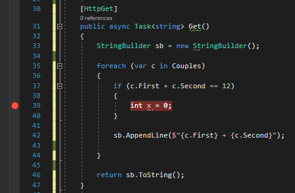
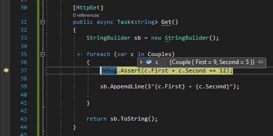
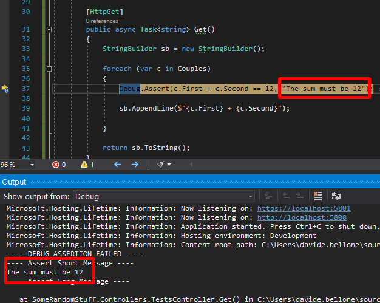

Sometimes, while debugging, you want to check if the state of your code is still valid, or, at least, it corresponds to some expectations.

A simple approach to this problem is to add an `if` statement with the condition you need to check and place a dummy instruction just to be marked with a breakpoint.

```cs
[HttpGet]
public async Task<string> Get()
{
    StringBuilder sb = new StringBuilder();

    foreach (var c in Couples)
    {
        if(c.First + c.Second == 12)
        {
            int x = 0;
            // just to put here the debugger
            // or place a Console.WriteLine,
            // which in most of the cases
            // is not available

        }

        sb.AppendLine($"{c.First} + {c.Second}");
    }

    return sb.ToString();
}
```



Which is fine, but it clutters your code.

Instead of placing breakpoints all over your code to manually check the application state (or use conditional breakpoints), you can create assertions that break your code only if launched in Debug mode.

```cs
[HttpGet]
public async Task<string> Get()
{
    StringBuilder sb = new StringBuilder();

    foreach (var c in Couples)
    {
        Debug.Assert(c.First + c.Second == 12);

        sb.AppendLine($"{c.First} + {c.Second}");

    }

    return sb.ToString();
}
```

⚠ Note: `Debug`, not `Debugger`!

With `Debug.Assert` can define a custom condition to be evaluated. If the check fails, the debugger automatically stops there to allow you to check the locals.



You can also add a message that can help you understand why the check fails:

```cs
foreach (var c in Couples)
{
    Debug.Assert(c.First + c.Second == 12, "The sum must be 12");

    sb.AppendLine($"{c.First} + {c.Second}");
}
```

To see the error message, you have to navigate to Debug > Windows > Output


where you can see the message you've defined before.



**Note: the messages are sent to the System.Diagnostics.Trace.Listeners collection**. If you have another listener, you can use it to intercept those messages.

Then you can add more details to that message, and you can also more info to the detailed message by adding additional parameters to it as if you were using `String.Format`.

```cs
foreach (var c in Couples)
{
    Debug.Assert(c.First + c.Second == 12, "The sum must be 12", " The actual sum is {0}", (c.First + c.Second));

    sb.AppendLine($"{c.First} + {c.Second}");
}
```

Again, run the application and have a look at the Output folder:


**Debug.Assert works only in DEBUG mode** - or, at least, when the DEBUG variable is defined. Otherwise, all those checks will simply get removed from the build result, so they will not impact your application when running in RELEASE mode.

_This article first appeared on [Code4IT 🐧](https://www.code4it.dev/)_

Happy coding!

🐧
