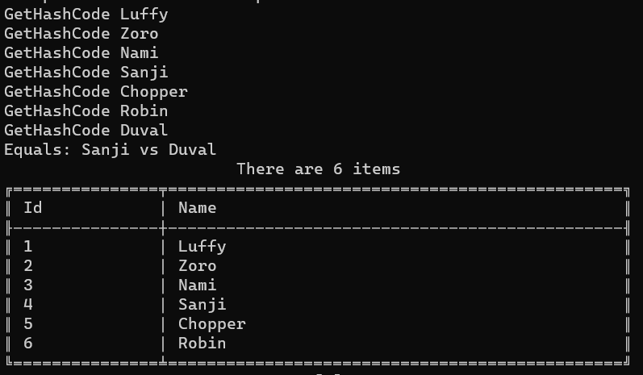
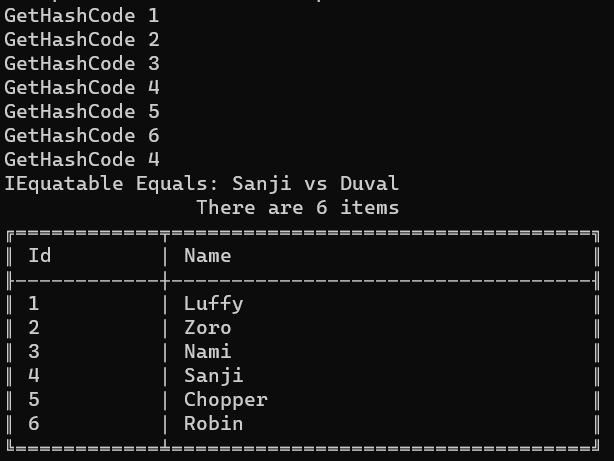

Sometimes, object instances can be considered equal even though some of their properties are different. Consider a movie translated into different languages: the Italian and French versions are different, but the movie is the same.

If we want to store unique values in a collection, we can use a `HashSet<T>`. But how can we store items in a `HashSet` when we must follow a custom rule to define if two objects are equal?

In this article, we will learn two ways to add custom equality checks when using a `HashSet`.

Let's start with a dummy class: `Pirate`.

```cs
public class Pirate
{
    public int Id { get; }
    public string Name { get; }

    public Pirate(int id, string username)
    {
        Id = id;
        Name = username;
    }
}
```

I'm going to add some instances of `Pirate` to a `HashSet`. Please, note that there are two pirates whose Id is 4:

```cs
List<Pirate> mugiwara = new List<Pirate>()
{
    new Pirate(1, "Luffy"),
    new Pirate(2, "Zoro"),
    new Pirate(3, "Nami"),
    new Pirate(4, "Sanji"), // This ...
    new Pirate(5, "Chopper"),
    new Pirate(6, "Robin"),
    new Pirate(4, "Duval"), // ... and this
};


HashSet<Pirate> hashSet = new HashSet<Pirate>();


foreach (var pirate in mugiwara)
{
    hashSet.Add(pirate);
}


_output.WriteAsTable(hashSet);
```

(I _really_ hope you'll get the reference 😂)

Now, what will we print on the console? (ps: `output` is just a wrapper around some functionalities provided by [Spectre.Console](https://spectreconsole.net/), that I used here to print a table)


As you can see, we have both Sanji and Duval: even though their Ids are the same, those are two distinct objects.

Also, we haven't told `HashSet` that the `Id` property must be used as a discriminator.

## Define a custom IEqualityComparer in a C# HashSet

In order to add a custom way to tell the `HashSet` that two objects can be treated as equal, we can define a **custom equality comparer**: it's nothing but a class that implements the `IEqualityComparer<T>` interface, where `T` is the name of the class we are working on.

```cs
public class PirateComparer : IEqualityComparer<Pirate>
{
    bool IEqualityComparer<Pirate>.Equals(Pirate? x, Pirate? y)
    {
        Console.WriteLine($"Equals: {x.Name} vs {y.Name}");
        return x.Id == y.Id;
    }

    int IEqualityComparer<Pirate>.GetHashCode(Pirate obj)
    {
        Console.WriteLine("GetHashCode " + obj.Name);
        return obj.Id.GetHashCode();
    }
}
```

The first method, `Equals`, compares two instances of a class to tell if they are equal, following the custom rules we write.

The second method, `GetHashCode`, defines a way to build an object's hash code given its internal status. In this case, I'm saying that the hash code of a Pirate object is just the hash code of its Id property.

To include this custom comparer, you must add a new instance of `PirateComparer` to the `HashSet` declaration:

```cs
HashSet<Pirate> hashSet = new HashSet<Pirate>(new PirateComparer());
```

Let's rerun the example, and admire the result:



As you can see, there is only one item whose Id is 4: Sanji.

Let's focus a bit on the messages printed when executing `Equals` and `GetHashCode`.

```text
GetHashCode Luffy
GetHashCode Zoro
GetHashCode Nami
GetHashCode Sanji
GetHashCode Chopper
GetHashCode Robin
GetHashCode Duval
Equals: Sanji vs Duval
```

Every time we insert an item, we call the `GetHashCode` method to generate an internal ID used by the HashSet to check if that item already exists.

As stated by [Microsoft's documentation](https://learn.microsoft.com/en-us/dotnet/fundamentals/runtime-libraries/system-object-gethashcode?wt.mc_id=DT-MVP-5005077),

> Two objects that are equal return hash codes that are equal. However, the reverse is not true: **equal hash codes do not imply object equality**, because different (unequal) objects can have identical hash codes.

This means that if the Hash Code is already used, it's not guaranteed that the objects are equal. That's why we need to implement the `Equals` method (hint: **do not just compare the HashCode of the two objects**!).

Is implementing a custom `IEqualityComparer` the best choice?

As always, it depends.

On the one hand, using a custom `IEqualityComparer` has the advantage of allowing you to have different `HashSets` work differently depending on the EqualityComparer passed in input; on the other hand, you are now forced to pass an instance of `IEqualityComparer` everywhere you use a HashSet — and if you forget one, you'll have a system with inconsistent behavior.

There must be a way to ensure consistency throughout the whole codebase.

## Implement the IEquatable interface

It makes sense to implement the equality checks directly inside the type passed as a generic type to the `HashSet`.

To do that, you need to have that class implement the `IEquatable<T>` interface, where `T` is the class itself.

Let's rework the Pirate class, letting it implement the `IEquatable<Pirate>` interface.

```cs
public class Pirate : IEquatable<Pirate>
{
    public int Id { get; }
    public string Name { get; }

    public Pirate(int id, string username)
    {
        Id = id;
        Name = username;
    }

    bool IEquatable<Pirate>.Equals(Pirate? other)
    {
        Console.WriteLine($"IEquatable Equals: {this.Name} vs {other.Name}");
        return this.Id == other.Id;
    }

    public override bool Equals(object obj)
    {
        Console.WriteLine($"Override Equals {this.Name} vs {(obj as Pirate).Name}");
        return Equals(obj as Pirate);
    }

    public override int GetHashCode()
    {
        Console.WriteLine($"GetHashCode {this.Id}");
        return (Id).GetHashCode();
    }
}
```

The `IEquatable` interface forces you to implement the `Equals` method. So, now we have two implementations of Equals (the one for `IEquatable` and the one that overrides the default implementation). Which one is correct? Is the `GetHashCode` really used?

Let's see what happens in the next screenshot:



As you could've imagined, the Equals method called in this case is the one needed to implement the IEquatable interface.

Please note that, as we don't need to use the custom comparer, the HashSet initialization becomes:

```cs
HashSet<Pirate> hashSet = new HashSet<Pirate>();
```

## What has the precedence: IEquatable or IEqualityComparer?

What happens when we use both `IEquatable` and `IEqualityComparer`?

Let's quickly demonstrate it.

First of all, keep the previous implementation of the Pirate class, where the equality check is based on the `Id` property:

```cs
public class Pirate : IEquatable<Pirate>
{
    public int Id { get; }
    public string Name { get; }

    public Pirate(int id, string username)
    {
        Id = id;
        Name = username;
    }

    bool IEquatable<Pirate>.Equals(Pirate? other)
    {
        Console.WriteLine($"IEquatable Equals: {this.Name} vs {other.Name}");
        return this.Id == other.Id;
    }

    public override int GetHashCode()
    {
        Console.WriteLine($"GetHashCode {this.Id}");
        return (Id).GetHashCode();
    }
}
```

Now, create a new `IEqualityComparer` where the equality is based on the `Name` property.

```cs
public class PirateComparerByName : IEqualityComparer<Pirate>
{
    bool IEqualityComparer<Pirate>.Equals(Pirate? x, Pirate? y)
    {
        Console.WriteLine($"Equals: {x.Name} vs {y.Name}");
        return x.Name == y.Name;
    }
    int IEqualityComparer<Pirate>.GetHashCode(Pirate obj)
    {
        Console.WriteLine("GetHashCode " + obj.Name);
        return obj.Name.GetHashCode();
    }
}
```

Now we have custom checks on both the Name and the Id.

It's time to add a new pirate to the list, and initialize the `HashSet` by passing in the constructor an instance of `PirateComparerByName`.

```cs
List<Pirate> mugiwara = new List<Pirate>()
{
    new Pirate(1, "Luffy"),
    new Pirate(2, "Zoro"),
    new Pirate(3, "Nami"),
    new Pirate(4, "Sanji"), // Id = 4
    new Pirate(5, "Chopper"), // Name = Chopper
    new Pirate(6, "Robin"),
    new Pirate(4, "Duval"), // Id = 4
    new Pirate(7, "Chopper") // Name = Chopper
};


HashSet<Pirate> hashSet = new HashSet<Pirate>(new PirateComparerByName());


foreach (var pirate in mugiwara)
{
    hashSet.Add(pirate);
}
```

We now have two pirates with ID = 4 and two other pirates with Name = Chopper.

Can you foresee what will happen?


The checks on the ID are totally ignored: in fact, the final result contains both Sanji and Duval, even if their IDs are the same. **The custom `IEqualityComparer` has the precedence over the `IEquatable` interface**.

_This article first appeared on [Code4IT 🐧](https://www.code4it.dev/)_

## Wrapping up

This started as a short article but turned out to be a more complex topic.

There is actually more to discuss, like performance considerations, code readability, and more. Maybe we'll tackle those topics in a future article.

I hope you enjoyed this article! Let's keep in touch on [LinkedIn](https://www.linkedin.com/in/BelloneDavide/) or [Twitter](https://twitter.com/BelloneDavide)! 🤜🤛

Happy coding!

🐧
