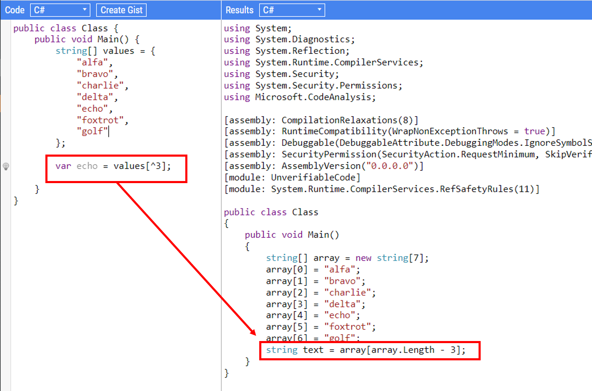

Say that you have an array of N items and you need to access an element counting from the end of the collection.

Usually, we tend to use the `Length` property of the array, and then subtract the number corresponding to the position we want to reach:

```cs
string[] values = {
    "alfa",
    "bravo",
    "charlie",
    "delta",
    "echo",
    "foxtrot",
    "golf"
};

var echo = values[values.Length - 3];
```

As you can see, we are accessing the same variable twice in a row: `values[values.Length - 3]`.

We can simplify that specific line of code by using the `^` operator:

```cs
string[] values = {
    "alfa",
    "bravo",
    "charlie",
    "delta",
    "echo",
    "foxtrot",
    "golf"
};

var echo = values[^3];
```

Yes, **that's just syntactic sugar**, but it can help make your code more readable. In fact, if you have a look at the IL code generated by both examples, they are perfectly identical. IL is quite difficult to read and understand, but you can acknowledge that both syntaxes are equivalent by looking at the decompiled C# code:



Performance is not affected by this operator, so it's just a matter of readability.

Clearly, you still have to **take care of array bounds** - if you access `values[^55]` you'll get an `IndexOutOfRangeException`.

Pay attention that **the position is 1-based**!

```cs
string[] values = {
    "alfa",
    "bravo",
    "charlie",
    "delta",
    "echo",
    "foxtrot",
    "golf"
};

Console.WriteLine(values[^1]); //golf
Console.WriteLine(values[^0]); //IndexOutOfRangeException
```

## Further readings

Using `^` is a nice trick that many C# developers don't know. There are some special characters that can help us but are often not used. Like the `@` operator!

🔗 [C# Tip: use the @ prefix when a name is reserved](https://www.code4it.dev/csharptips/use-at-symbol-prefix/)

_This article first appeared on [Code4IT 🐧](https://www.code4it.dev/)_

## Wrapping up

In this article, we've learned that just using the right syntax can make our code much more readable.

But we also learned that not every new addition in the language brings performance improvements to the table.

I hope you enjoyed this article! Let's keep in touch on [Twitter](https://twitter.com/BelloneDavide) or on [LinkedIn](https://www.linkedin.com/in/BelloneDavide/), if you want! 🤜🤛

Happy coding!

🐧
