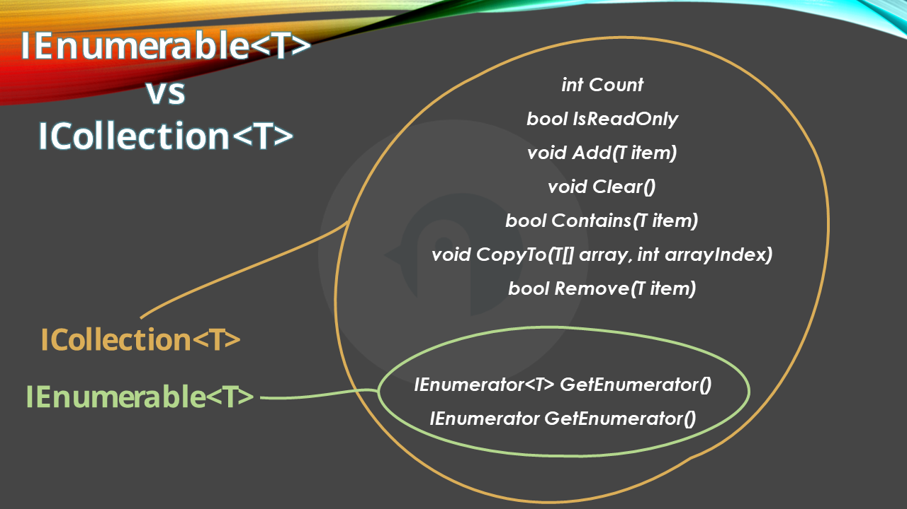

Defining the right return type is crucial to create a shared library whose behavior is totally under your control.

You should give the consumers of your library just the right amount of freedom for integrating and using the classes and structures you have defined. That's why it can be important to know the differences between similar interfaces like `IEnumerable<T>` and `ICollection<T>`.

## IEnumerable: just enumerate the collection

Suppose that `IAmazingInterface` is an interface you expose, so that clients can interact with it without knowing the internal behavior.

You have defined it this way:


```cs
public interface IAmazingInterface
{
    IEnumerable<int> GetNumbers(int[] numbers);
}
```

As you can see, the `GetNumbers` returns an `IEnumerable<int>`: this means that (unless they do some particular tricks like using reflection), clients will only be able to loop through the collection of items.

Clients don't know that, behind the scenes, `AmazingClass` uses a custom class `MySpecificEnumberable`.


```cs
public class AmazingClass : IAmazingInterface
{
    public IEnumerable<int> GetNumbers(int[] numbers) => new MySpecificEnumberable(numbers);
}
```

`MySpecificEnumberable` is a custom class whose purpose is to store the initial values in a sorted way. It implements `IEnumerable<int>`, so the only operations you have to support are the two implementations of `GetEnumerator()` - pay attention to the returned data type!

```cs
public class MySpecificEnumberable : IEnumerable<int>
{
    private readonly int[] _numbers;

    public MySpecificEnumberable(int[] numbers)
    {
        _numbers = numbers.OrderBy(_ => _).ToArray();
    }

    public IEnumerator<int> GetEnumerator()
    {
        foreach (var number in _numbers)
        {
            yield return number;
        }
    }

    IEnumerator IEnumerable.GetEnumerator() => _numbers.GetEnumerator();
}
```

Clients will then be able to loop all the items in the collection:


```cs
 IAmazingInterface something = new AmazingClass();
 var numbers = something.GetNumbers([1, 5, 6, 9, 8, 7, 3]);


 foreach (var number in numbers)
 {
     Console.WriteLine(number);
 }
```

But cannot add nor remove items from it.

## ICollection: list, add, and remove items

As we saw, `IEnumerable` only allows you to loop through all the elements. However, you cannot add or remove items from an `IEnumerable`. 

To do so, you need something that implements `ICollection`.


```cs
class MySpecificCollection : ICollection<int>
{
    public int Count => throw new NotImplementedException();
    public bool IsReadOnly => throw new NotImplementedException();
    public void Add(int item) => throw new NotImplementedException();
    public void Clear() => throw new NotImplementedException();
    public bool Contains(int item) => throw new NotImplementedException();
    public void CopyTo(int[] array, int arrayIndex) => throw new NotImplementedException();
    public IEnumerator<int> GetEnumerator() => throw new NotImplementedException();
    public bool Remove(int item) => throw new NotImplementedException();
    IEnumerator IEnumerable.GetEnumerator() => throw new NotImplementedException();
}
```

`ICollection<T>` extends `IEnumerable<T>`, so everything we said before is still valid. 

However, a class that implements `ICollection<T>` allows you to have control on how items can be added or removed from the collection, giving you the possibilty to define a custom behavior.

For instance, we can say that the `Add` method adds an integer only if it's an odd number.

## Why does it all matter?

Classes and interfaces are meant to be used. If you are like me, you work both on the creation of the class and the way it is consumed.

So, if an inteface must return a sequence of items, you most probably use the `List` shortcut: define the return type of the method as `List<Item>`, and then use it, regardless of having it looped through or having the consumer add items to the sequece.

```cs
// in the interface
public interface ISomething
{
    List<Item> PerformSomething(int[] numbers);
}


// in the consumer class
ISomething instance = //omitted
List<Item> myItems = instance.PerformSomething([2, 3, 4, 5]);
```

Everything works fine. But it works only becase we are in control of both the definition and the consumer.

What if you have to expose the library to something outside your control?

You have to consider two elements:

- consumers should not be able to tamper with your internal implementation (for example, by adding items when they are not supposed to);
- you should be able to change the internal implementation as you wish without breaking changes.


So, if you want your users to just enumerate the items within a collection, you may start this way:

```cs
// in the interface
public interface ISomething
{
    IEnumerable<Item> PerformSomething(int[] numbers);
}

// in the implementation

IEnumerable<Item> PerformSomething(int[] numbers)
{
    return numbers.Select(x => new Item(x)).ToList();
}

// in the consumer class

ISomething instance = //omitted
List<Item> myItems = instance.PerformSomething([2, 3, 4, 5]);
```

Then, when the time comes, you can change the internal implementation of `PerformSomething` with a more custom class:

```cs
// custom IEnumerable
public class MyCustomEnumberable : IEnumerable<Item> { /*omitted*/ }


// in the interface
IEnumerable<Item> PerformSomething(int[] numbers)
{
    MyCustomEnumberable customEnumerable = new MyCustomEnumberable();
    customEnumerable.DoSomething(numbers);
    return customEnumerable;
}
```

and the consumer will not notice the difference. Again, unless they try to use tricks to tamper with your code!


_This article first appeared on [Code4IT 🐧](https://www.code4it.dev/)_

## Wrapping up

While getting the differences between `IEnumerable` an `ICollection` is trivial, understanding why you should care about it is not.



I hope this article helped you understand that yeah, you can take the easy way and return everywhere a `List`, but it's a choice that you cannot always apply to a project, and that probably will make breaking changes more frequent in the long run.

I hope you enjoyed this article! Let's keep in touch on [LinkedIn](https://www.linkedin.com/in/BelloneDavide/) or [Twitter](https://twitter.com/BelloneDavide)! 🤜🤛

Happy coding!

🐧


- [ ] Grammatica
- [ ] Titoli
- [ ] Frontmatter
- [ ] Immagine di copertina
- [ ] Fai resize della immagine di copertina
- [ ] Metti la giusta OgTitle
- [ ] Bold/Italics
- [ ] Nome cartella e slug devono combaciare
- [ ] Rinomina immagini
- [ ] Trim corretto per bordi delle immagini
- [ ] Alt Text per immagini
- [ ] Rimuovi secrets dalle immagini
- [ ] Controlla se ASP.NET Core oppure .NET
- [ ] Pulizia formattazione
- [ ] Add wt.mc_id=DT-MVP-5005077 to links